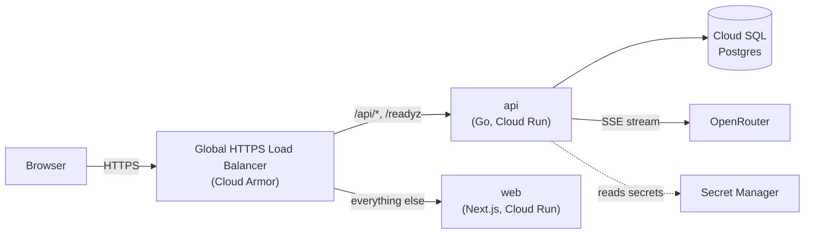
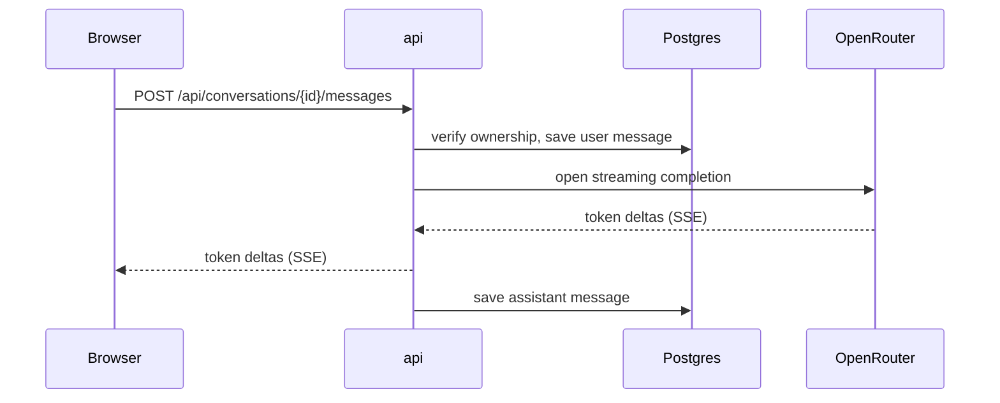

# Architecture

chat-lucek runs as two Cloud Run services behind a single domain. A Global HTTPS load balancer routes by path: API traffic goes to the Go service, everything else to the Next.js frontend. The API is the only service that reaches the database, the LLM provider, and secrets.

## Components

- **web** serves the Next.js App Router UI. It holds no data of its own; every dynamic action calls the API.
- **api** owns all state and integrations: authentication, conversation storage, and the streaming chat endpoint.
- **Cloud SQL** is the single Postgres instance backing the API.
- **OpenRouter** is the upstream LLM provider, consumed as a raw SSE stream.

## Streaming a reply

The API verifies ownership, persists the user message, streams tokens straight from OpenRouter to the browser, and saves the full reply once the stream closes.

