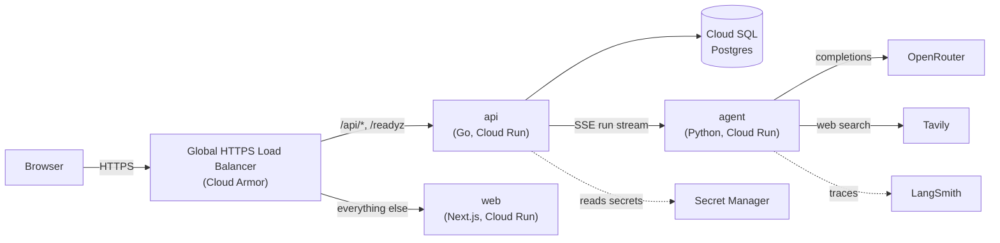
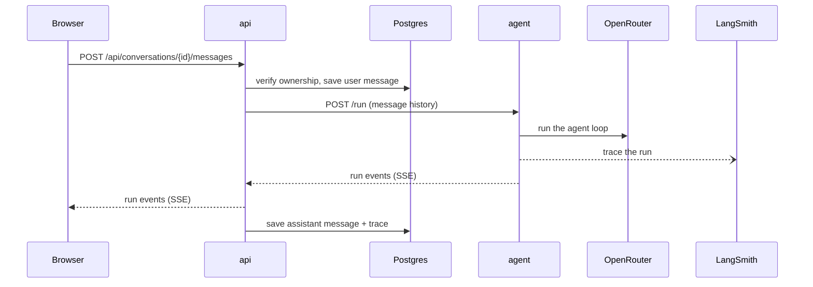

# Architecture

chat-lucek runs as three Cloud Run services. A Global HTTPS load balancer fronts two of them, routing by path: API traffic to the Go service, everything else to the Next.js frontend. The third, the agent, sits behind the API: it grants the invoke role only to the API's service account, which calls it with an ID token. The API owns the database and secrets; the agent owns the LLM provider and web search.

## Components

- **web** serves the Next.js App Router UI. It holds no data of its own; every dynamic action calls the API.
- **api** owns all state and auth: sign-in (Google or an email magic link), conversation storage, and the chat endpoint, which runs the agent and relays its stream to the browser.
- **agent** is a LangGraph agent behind one streaming `/run` endpoint. It runs the model loop and emits its run as an ordered event stream.
- **Cloud SQL** is the single Postgres instance backing the API.
- **OpenRouter** is the upstream LLM provider, and **Tavily** backs the agent's web search.
- **LangSmith** receives a trace of every agent run, for step-level debugging of reasoning, tools, and subagents.

## Streaming a reply

The API verifies ownership, persists the user message, opens a run on the agent, relays the agent's event stream to the browser, and saves the reply and its run trace once the stream closes.

