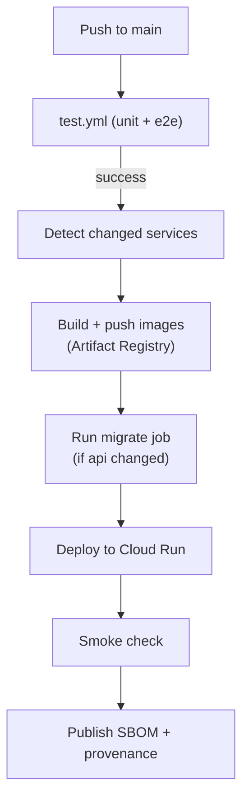

# Deployment

The infrastructure is Terraform-managed on GCP, and GitHub Actions builds and ships to Cloud Run on every push to `main`. The first section covers that ongoing pipeline; the second is a full runbook for standing the project up from nothing.

## Pipeline

Every push to `main` runs [test.yml](../.github/workflows/test.yml); on success, [deploy.yml](../.github/workflows/deploy.yml) deploys only the services that changed. It authenticates to GCP with Workload Identity Federation, so no service account keys are stored.



Images are tagged with the commit SHA, and the deploy updates each Cloud Run service to that tag. The smoke check confirms the site returns 200 and the API rejects an unauthenticated request before the run is considered successful.

## First-time setup

A from-scratch bootstrap. Commands use `<project-id>` for your GCP project; the region defaults to `us-central1` and the domain to `chat.lucek.ai`.

### 1. Prerequisites

- gcloud CLI, authenticated with `gcloud auth login` and `gcloud auth application-default login` (Terraform uses the application-default credentials)
- Terraform 1.9+
- Docker
- A GCP project and a registered domain
- The GitHub repository (for CI)

### 2. State bucket

Terraform state can't live in the state it stores, so create its bucket by hand once:

```bash
gcloud config set project <project-id>
gcloud storage buckets create gs://<project-id>-tfstate \
  --location=us-central1 --uniform-bucket-level-access
gcloud storage buckets update gs://<project-id>-tfstate --versioning
```

### 3. Google OAuth client

In the GCP console, create an OAuth 2.0 Client ID (Web application). Add `https://chat.lucek.ai` and `http://localhost:3000` as authorized JavaScript origins. Keep the client ID and secret for the next steps.

### 4. Configure and initialize Terraform

From `infra/`, fill in the two files from their examples:

```bash
cp backend.hcl.example backend.hcl          # bucket = "<project-id>-tfstate"
cp infra.tfvars.example terraform.tfvars     # project_id, google_client_id, owner_email, billing_account
terraform init -backend-config=backend.hcl
```

### 5. Seed bootstrap images

The Cloud Run services reference `:bootstrap` images that must exist before they can be created. Apply just the Artifact Registry repo first, then push placeholders. Build for `linux/amd64` (Cloud Run's architecture; a default build on an Apple Silicon Mac is arm64 and fails to start):

```bash
terraform apply -target=google_artifact_registry_repository.chat
gcloud auth configure-docker us-central1-docker.pkg.dev

REGISTRY=us-central1-docker.pkg.dev/<project-id>/chat
docker build --platform linux/amd64 -t $REGISTRY/api:bootstrap ./api && docker push $REGISTRY/api:bootstrap
docker build --platform linux/amd64 \
  --build-arg NEXT_PUBLIC_API_URL=https://chat.lucek.ai \
  --build-arg NEXT_PUBLIC_GOOGLE_CLIENT_ID=<client-id> \
  -t $REGISTRY/web:bootstrap ./web && docker push $REGISTRY/web:bootstrap
docker build --platform linux/amd64 -t $REGISTRY/agent:bootstrap ./agent && docker push $REGISTRY/agent:bootstrap
```

### 6. Apply

```bash
terraform apply
```

This creates everything else: Cloud SQL, the Cloud Run services and migrate job, the load balancer, Cloud Armor, Workload Identity Federation, and monitoring.

### 7. Secrets and database password

Set the six secret values, and set the database user's password to match the `db-password` secret. The agent reads `openrouter-api-key`, `tavily-api-key`, and `langsmith-api-key`; the API reads the rest:

```bash
openssl rand -hex 32 | tr -d '\n' | gcloud secrets versions add jwt-secret --data-file=-
printf '%s' '<openrouter-key>'    | gcloud secrets versions add openrouter-api-key --data-file=-
printf '%s' '<tavily-key>'        | gcloud secrets versions add tavily-api-key --data-file=-
printf '%s' '<langsmith-key>'     | gcloud secrets versions add langsmith-api-key --data-file=-
printf '%s' '<google-client-secret>' | gcloud secrets versions add google-client-secret --data-file=-

DB_PW=$(openssl rand -hex 24)
printf '%s' "$DB_PW" | gcloud secrets versions add db-password --data-file=-
gcloud sql users set-password app --instance=chat --password="$DB_PW"
```

Then run the migrations through the Cloud Run job:

```bash
gcloud run jobs execute chat-migrate --region us-central1 --wait
```

### 8. GitHub Actions variables

Set these repository variables (all come from `terraform output`) and create a `production` environment:

| Variable | Source |
| --- | --- |
| `GCP_PROJECT` | your project ID |
| `GCP_REGION` | `us-central1` |
| `DOMAIN` | `chat.lucek.ai` |
| `GOOGLE_CLIENT_ID` | the OAuth client ID |
| `WIF_PROVIDER` | `terraform output wif_provider` |
| `DEPLOY_SA` | `terraform output deploy_sa_email` |

### 9. DNS

Point the domain's A-record at the load balancer IP, then wait for the managed certificate to provision (this can take up to an hour):

```bash
terraform output -raw lb_ip
```

### 10. First deploy

Push to `main`. CI builds the real images, runs migrations, deploys the services, and the site comes up at your domain.

### Optional: LangSmith online evals

`infra/langsmith.tf` provisions code evaluators that score live prod traces (see [agent/evals/README.md](../agent/evals/README.md)). The same Terraform manages them, but they authenticate to LangSmith rather than GCP. Add the workspace API key and ID to `terraform.tfvars`:

```hcl
langsmith_api_key      = "<workspace-api-key>"
langsmith_workspace_id = "<workspace-id>"
```