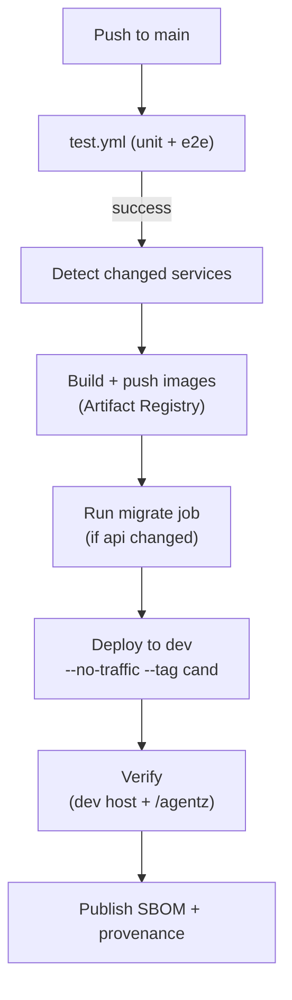
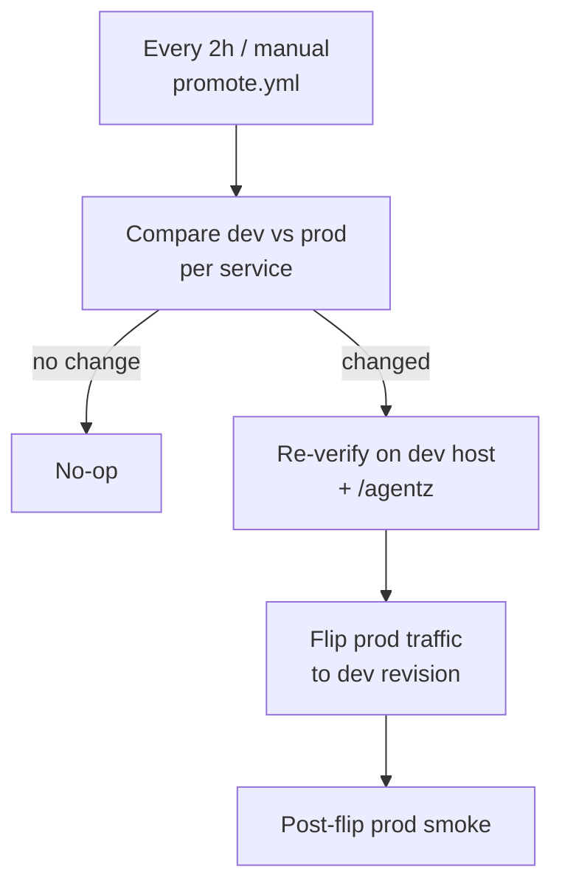

# Deployment

The infrastructure is Terraform-managed on GCP. On every push to `main`, GitHub Actions builds the changed services and deploys them to a dev environment; production is promoted from dev on a schedule. The first section covers that ongoing pipeline; the second is a full runbook for standing the project up from nothing.

## Pipeline

The pipeline is a release train. Every push to `main` deploys the changed services to a persistent dev environment; production is promoted from dev as an atomic snapshot every two hours and on demand. GitHub Actions authenticates to GCP with Workload Identity Federation, so no service account keys are stored.

### Deploy to dev

Every push to `main` runs [test.yml](../.github/workflows/test.yml); on success, [deploy.yml](../.github/workflows/deploy.yml) builds and deploys only the changed services as new Cloud Run revisions tagged `cand`, with no production traffic. `dev.chat.lucek.ai` serves the `cand` revisions, so dev always reflects the latest main.



Images are tagged with the commit SHA. A revision must pass its Cloud Run startup probe to become ready, then it is verified through the private dev host: `/readyz` and an unauthenticated `/api/me` for the api, the homepage for web, and `/agentz` for the agent. On the dev host the api routes to the candidate agent, and `/agentz` makes it do a canned round-trip there (requiring a streamed answer with non-zero token usage), so the api-to-agent path is exercised end to end. A revision with a broken model key, graph, or config fails here rather than on the first user message, and is never eligible for promotion.

### Promote to prod

[promote.yml](../.github/workflows/promote.yml) runs every two hours and on demand. It flips production traffic to the revisions currently serving dev, across all three services at once, and is a no-op when dev already equals prod.



Promotion is blue-green: production's live revision is replaced by the dev revision, and the previous revision is retained, so rollback is an instant traffic flip back (see the [rollback runbook](runbooks/rollback.md)). Because deploy and promote are separate, the revisions being promoted are re-verified on the dev host first (including the agent via `/agentz`, catching external drift such as an expired model key), so a revision that failed its deploy checks is never promoted. A post-flip smoke on the production domain confirms the flip took effect.

To release the current dev snapshot immediately instead of waiting for the schedule, dispatch `promote.yml`. To deploy an arbitrary branch or commit straight to production, bypassing the train, dispatch [manual-deploy.yml](../.github/workflows/manual-deploy.yml) (see the [manual deploy runbook](runbooks/manual-deploy.md)); it refuses any commit that has not passed CI.

### Database migrations

The migrate job runs when a revision is deployed to dev, against the database that dev and production share. Because production is promoted from dev on a cadence, the live production revision runs against the already-migrated schema until the next promotion. Migrations are therefore strictly expand-and-contract: additive and backward-compatible first, with destructive changes held for a later release once no running code depends on the old shape. A new column is added and backfilled in one release; the old column is dropped in a later one, after the release that used it has been promoted. The backward-compatibility window is the release cadence, not minutes, so a destructive change must never ride in the same release as the expand it depends on.

The `migrations-check` job runs [squawk](https://squawkhq.com) over each migration's Up block and fails on backward-incompatible DDL: dropping or renaming a column, changing a column type, or adding a NOT NULL column without a default. Rules are set in [`api/scripts/.squawk.toml`](../api/scripts/.squawk.toml), with the zero-downtime locking rules disabled. A statement that must break a rule carries an inline `-- squawk-ignore <rule>` comment.

### Private dev environment

`dev.chat.lucek.ai` serves the `cand`-tagged Cloud Run revisions (the latest main) through the same load balancer, on its own managed certificate. Identity-Aware Proxy gates it: only the `owner_email` Google account and the deploy service account hold `roles/iap.httpsResourceAccessor`, so an unauthenticated request gets a 403 and browsing prompts a Google login.

IAP needs its service agent, which Terraform can't provision. Create it once after the first apply:

```bash
gcloud beta services identity create --service=iap.googleapis.com
```

## First-time setup

A from-scratch bootstrap. Commands use `<project-id>` for your GCP project; the region defaults to `us-central1` and the domain to `chat.lucek.ai`.

### 1. Prerequisites

- gcloud CLI, authenticated with `gcloud auth login` and `gcloud auth application-default login` (Terraform uses the application-default credentials)
- Terraform 1.9+
- Docker
- A GCP project and a registered domain
- The GitHub repository (for CI)

### 2. State bucket

Terraform state can't live in the state it stores, so create its bucket by hand once:

```bash
gcloud config set project <project-id>
gcloud storage buckets create gs://<project-id>-tfstate \
  --location=us-central1 --uniform-bucket-level-access
gcloud storage buckets update gs://<project-id>-tfstate --versioning
```

### 3. Google OAuth clients

Create two OAuth 2.0 Client IDs (Web application) in the GCP console; both share the one project consent screen.

1. **App sign-in.** Add `https://chat.lucek.ai`, `https://dev.chat.lucek.ai`, and `http://localhost:3000` as authorized JavaScript origins (the dev origin lets Google Sign-In work on the private dev host). This is the frontend Google Sign-In client; keep its client ID and secret.
2. **IAP** (for the private dev host, see below). Leave JavaScript origins empty. After creating it, edit it and add the authorized redirect URI `https://iap.googleapis.com/v1/oauth/clientIds/<CLIENT_ID>:handleRedirect` using its own client ID. Keep its client ID and secret for `iap_oauth_client_id` / `iap_oauth_client_secret`.

### 4. Configure and initialize Terraform

From `infra/`, fill in the two files from their examples:

```bash
cp backend.hcl.example backend.hcl          # bucket = "<project-id>-tfstate"
cp terraform.tfvars.example terraform.tfvars     # replace every placeholder value
terraform init -backend-config=backend.hcl
```

### 5. Seed bootstrap images

The Cloud Run services reference `:bootstrap` images that must exist before they can be created. Apply just the Artifact Registry repo first, then push placeholders. Build for `linux/amd64` (Cloud Run's architecture; a default build on an Apple Silicon Mac is arm64 and fails to start):

```bash
terraform apply -target=google_artifact_registry_repository.chat
gcloud auth configure-docker us-central1-docker.pkg.dev

REGISTRY=us-central1-docker.pkg.dev/<project-id>/chat
docker build --platform linux/amd64 -t $REGISTRY/api:bootstrap ./api && docker push $REGISTRY/api:bootstrap
docker build --platform linux/amd64 \
  --build-arg NEXT_PUBLIC_API_URL=https://chat.lucek.ai \
  --build-arg NEXT_PUBLIC_GOOGLE_CLIENT_ID=<client-id> \
  -t $REGISTRY/web:bootstrap ./web && docker push $REGISTRY/web:bootstrap
docker build --platform linux/amd64 -t $REGISTRY/agent:bootstrap ./agent && docker push $REGISTRY/agent:bootstrap
```

### 6. Apply

```bash
terraform apply
```

This creates everything else: Cloud SQL, the Cloud Run services and migrate job, the load balancer, Cloud Armor, Workload Identity Federation, and monitoring.

### 7. Secrets and database password

Set the seven secret values, and set the database user's password to match the `db-password` secret. The agent reads `openrouter-api-key`, `tavily-api-key`, and `langsmith-api-key`; the API reads the rest, and also `langsmith-api-key` to attach response feedback to traces. `usage-hash-secret` keys the usage ledger and must never be rotated (rotating it resets every user's budget window). The API's magic-link Resend key is not seeded here: Terraform sets `resend-api-key` from the `resend_api_key` tfvar (the same key the eval alerts use), with the sender in the `magic_link_from` tfvar (default `login@lucek.ai`):

```bash
openssl rand -hex 32 | tr -d '\n' | gcloud secrets versions add jwt-secret --data-file=-
openssl rand -hex 32 | tr -d '\n' | gcloud secrets versions add usage-hash-secret --data-file=-
printf '%s' '<openrouter-key>'    | gcloud secrets versions add openrouter-api-key --data-file=-
printf '%s' '<tavily-key>'        | gcloud secrets versions add tavily-api-key --data-file=-
printf '%s' '<langsmith-key>'     | gcloud secrets versions add langsmith-api-key --data-file=-
printf '%s' '<google-client-secret>' | gcloud secrets versions add google-client-secret --data-file=-

DB_PW=$(openssl rand -hex 24)
printf '%s' "$DB_PW" | gcloud secrets versions add db-password --data-file=-
gcloud sql users set-password app --instance=chat --password="$DB_PW"
```

The API rate limiter is optional and off by default. To enforce the request limits globally across instances, create an Upstash Redis database in the same region as Cloud Run and set its `rediss://` connection string in the `upstash_redis_url` tfvar. Leaving it empty keeps the limits in-memory, per instance.

Then run the migrations through the Cloud Run job:

```bash
gcloud run jobs execute chat-migrate --region us-central1 --wait
```

### 8. GitHub Actions variables

Set these repository variables (all come from `terraform output`) and create two environments, `dev` and `production`, with no protection rules. The dev-deploy jobs run in `dev` and the promote jobs run in `production`; Terraform grants both environments permission to impersonate the deploy service account.

| Variable | Source |
| --- | --- |
| `GCP_PROJECT` | your project ID |
| `GCP_REGION` | `us-central1` |
| `DOMAIN` | `chat.lucek.ai` |
| `GOOGLE_CLIENT_ID` | the app sign-in OAuth client ID |
| `IAP_OAUTH_CLIENT_ID` | the IAP OAuth client ID (used to smoke the dev host) |
| `WIF_PROVIDER` | `terraform output wif_provider` |
| `DEPLOY_SA` | `terraform output deploy_sa_email` |

### 9. DNS

Point the domain's A-record at the load balancer IP, then wait for the managed certificate to provision (this can take up to an hour):

```bash
terraform output -raw lb_ip
```

Add a second A-record for `dev.chat.lucek.ai` pointing at the same IP (the private dev host, below). Each host gets its own managed cert, so both provision independently.

### 10. First deploy

Push to `main`. CI builds the real images, runs migrations, deploys the services, and the site comes up at your domain.

### LangSmith online evals

`infra/langsmith.tf` provisions code evaluators that score live prod traces (see [agent/evals/README.md](../agent/evals/README.md)). The same Terraform manages them, but they authenticate to LangSmith rather than GCP. Set the LangSmith values in `terraform.tfvars`:

```hcl
langsmith_project       = "<tracing-project-name>"
langsmith_api_key       = "<workspace-api-key>"
langsmith_workspace_id  = "<workspace-id>"
injection_prompt_commit = "<prompt-hub-commit-hash>"
# plus one *_prompt_commit per additional LLM judge (see below)
```

Some evaluators are LLM-as-judge rather than code. Each is a self-contained file in [`agent/evals/online/`](../agent/evals/online/) holding its prompt, output schema, and model, published to the LangSmith Prompt Hub and referenced by Terraform via a pinned commit. For each judge:

1. Add a workspace secret (Settings, Secrets) for the API key its model uses. The prompt-injection judge calls its model through OpenRouter's OpenAI-compatible endpoint, so its secret is `OPENAI_API_KEY` set to an OpenRouter key.
2. Publish it and pin the commit:

```bash
make push-llm-judge JUDGE=<name>   # e.g. prompt_injection; prints a commit hash
# set the hash as the judge's *_prompt_commit var in terraform.tfvars, then terraform apply
```

Publishing constructs the model client locally to serialize it, so `agent/.env` needs `OPENAI_API_KEY` set to any non-empty placeholder. The model only ever runs server-side in LangSmith under the workspace secret, so the local value is never used for inference.

### Alert emails

`infra/langsmith.tf` also provisions `langsmith_alert_rule` resources that email the owner: two when a security evaluator scores positive (`pii_detected` or `prompt_injection_score`), and one when 5 or more replies get a thumbs-down (`user_score = 0`) in an hour. LangSmith delivers them by POSTing to Resend's send API. Set the Resend values in `terraform.tfvars`:

```hcl
resend_api_key = "<resend-send-scoped-key>"
# alert_email_from = "alerts@lucek.ai"   # optional; must be a verified Resend sender
```

Emails go to `owner_email`. Use a send-scoped key: LangSmith stores the webhook config to replay the call, so the key lands in LangSmith and in Terraform state. The sending domain must be verified in Resend. After `terraform apply`, fire a test from the LangSmith alert UI to confirm delivery.